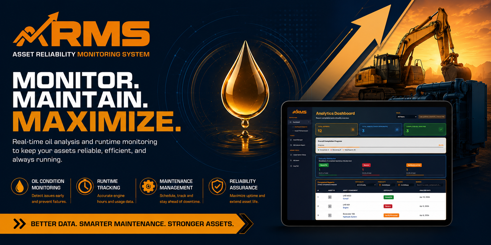
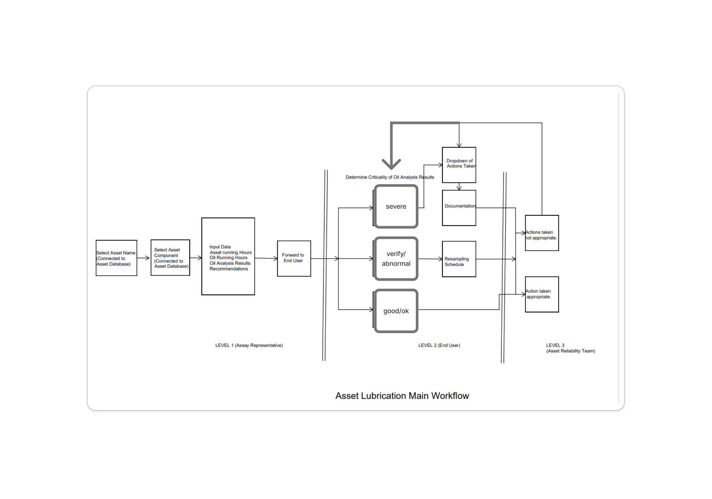

<!-- 

<h1>LMD ASSET RELIABILITY MONITORING SYSTEM ( A R M S )</h1>

<h3>FLOWCHART</h3>

<h4>LIVE DEMO: <a href='https://arms-supabase.vercel.app'>https://arms-supabase.vercel.app/</a> </h4>

<b>USERNAME: test</b>

<b>PASSWORD: 123456</b>

Node Version : v24.2.0  
SQL Version: 20.2.30.0 -->

# 🛡️ LMD ASSET RELIABILITY MONITORING SYSTEM (A R M S)

### _Predict. Prevent. Perform. — Intelligent Asset Reliability for Industry 4.0_

---

## 🎯 What is ARMS?

**ARMS** (Asset Reliability Monitoring System) is a modern, cloud-native solution designed for **maintenance engineers**, **plant operators**, and **reliability teams** who refuse to be surprised by equipment failures.

> **Stop reacting. Start predicting.**

ARMS continuously monitors your critical assets, detects early warning signs, visualizes performance trends, and delivers actionable reliability insights — all from a beautiful, intuitive dashboard.

---

## 🔓 Live Demo Access

> **Try it now — no installation required!**

| | |
| :--- | :--- |
| 🌐 **Live URL** | [https://arms-supabase.vercel.app/](https://arms-supabase.vercel.app/) |
| 👤 **Username** | `test` |
| 🔑 **Password** | `123456` |

*Use the credentials above to explore the full dashboard, add assets, and generate reliability reports.*

---

## 🧠 System Architecture (How It Works)

<h3 align="center">📊 ARMS FLOWCHART</h3>

*The flowchart above illustrates how data flows from asset sensors → database → analytics engine → user dashboard.*

---

## ✨ Core Capabilities

| Module | Description | Value Delivered |
| :--- | :--- | :--- |
| 📡 **Real-time Monitoring** | Live asset parameters (temp, vibration, runtime) | Instant anomaly detection |
| 📈 **Reliability KPIs** | MTBF, MTTR, Availability, P-F curve tracking | Data-backed maintenance decisions |
| 🔔 **Smart Alerts** | Threshold-based & predictive notifications | Reduced unplanned downtime |
| 🗂️ **Asset Registry** | Complete digital twin with maintenance history | Single source of truth |
| 📊 **Analytics Engine** | Trend visualization & failure pattern recognition | Optimized spare parts inventory |
| 👥 **Role-based Access** | Operator, Engineer, Admin permissions | Secure team collaboration |

---

## 🛠️ Technical Stack

| Layer | Technology | Version |
| :--- | :--- | :--- |
| **Runtime** | Node.js | `v24.2.0` |
| **Database** | SQL SERVER 2020 | `20.2.30.0` |
| **Framework** | React.js | Latest |
| **Hosting** | Vercel (Edge-optimized) | — |
| **Realtime** | Supabase Realtime WebSockets | — |

